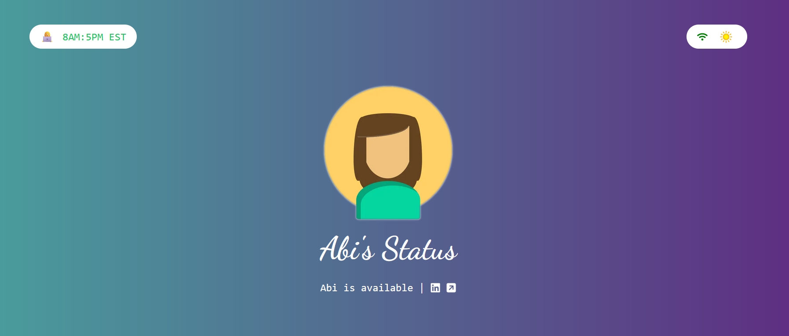

# My Status

[](https://opensource.org/licenses/MIT)

This is a little status website I made so I could stop texting my co-workers every time the wifi goes out. I live in a rural area of the USA and the wifi is frequently down for several hours due to storms. This website uses the [UptimeRobot](https://uptimerobot.com/) API and the [WeatherAPI](https://www.weatherapi.com/)


## Getting Started
Copy the `.env.example` file and rename it to `.env.local`.

```bash
cp .env.example .env.local
```

You will need to sign up at UptimeRobot and create a monitor for your router's IP. I had to use my router's DNS IP to get it to ping appropriately. From there, create a read-only API key (or any API key, I'm not checking) and add it to the .env.local file. 

Sign up for the WeatherAPI as well to use their API.


Finally, run the development server to test.

```bash
npm run dev
```

Open [http://localhost:3000](http://localhost:3000) with your browser to see the result.

You should see a pretty sweet status website! 


## Things to customize
I didn't make this very configurable so be sure to customize in the code as needed.
- The name `Abi` is hardcoded on the main page and in the `Status.tsx` component.
- My LinkedIn and Website are also hardcoded in `Status.tsx`. 
- The images in the `Status.tsx` component are fun to customize.
- The dancing font has a very specific vibe. Great opportunity for customization.

## Deploy on Vercel

I deployed on the [Vercel Platform](https://vercel.com/new?utm_medium=default-template&filter=next.js&utm_source=create-next-app&utm_campaign=create-next-app-readme) from the creators of Next.js. It's super easy and I had no problems.

> Be sure to lint and run a build before deploying so you can solve issues locally

Check out the [Next.js deployment documentation](https://nextjs.org/docs/deployment) for more details.
